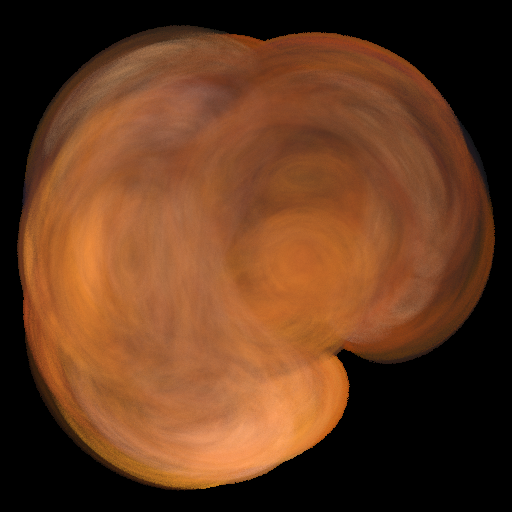

# Iterated function system

A C++ implementation of an
[iterated function system](https://en.wikipedia.org/wiki/Iterated_function_system).

# Build

Build using CMake:

    % mkdir build
    % cd build
    % cmake ..
    % make

It compiles on MacOS and Linux.

# Running

Specify the name of the config file on the command line:

    % build/ifs configs/leaf3.config

In interactive mode on MacOS it will pop up a window and show
the image in increasing detail. In batch mode it will run a
specified number of iterations and generate a PNG file.

# Config file

The configuration file has three sections.

The first line is the name of the color map to use. See the `ColorMap.txt` file
for possible names.

The second section is the list of attractors. The first line
is the number of attractors, followed by one attractor per line.
Each attractor line has a probability, a color, an attractor
type, and attractor parameters. Use probability 0 to equally distribute
probabilities across all attractors. The color is a number 0
to 1 mapping across the 256 entries in the color table. Attractor
types are:

* `average`: Move half way to the specified (`x`,`y`) point.
* `complex`: Attractor that treats the point like a complex number
  (with X the real value and Y the imaginary value). The parameters
  are two values, S and A (each two numbers, real and imaginary).
  The transform brings the point a fraction of the way to A. If
  S is (0,0), the point is moved to A. If it's (1,0), it stays where it is.
* `transform`: Multiplies the point by the 2x3 matrix:

      | a  b  e |
      | c  d  f |

The last line of the config file is a sequence of seven reals,
mapping to the seven variations specified in the `Variations.h`
file. They're hard to define, see that source file for details.
If you're not sure, set the first to 1 and the rest to 0. That
will leave the points unmodified.

See the `configs` directory for examples.

# License

Copyright 2018 Lawrence Kesteloot

Licensed under the Apache License, Version 2.0 (the "License");
you may not use this file except in compliance with the License.
You may obtain a copy of the License at

   http://www.apache.org/licenses/LICENSE-2.0

Unless required by applicable law or agreed to in writing, software
distributed under the License is distributed on an "AS IS" BASIS,
WITHOUT WARRANTIES OR CONDITIONS OF ANY KIND, either express or implied.
See the License for the specific language governing permissions and
limitations under the License.
